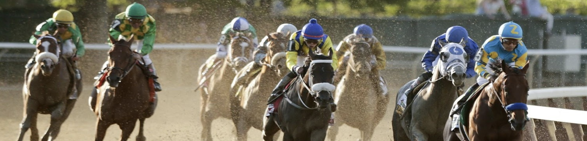

# ML Horse Prediction

## Team Members

- John O'Sullivan
- Brianne Coffey
- Noel Castillo
- Sebasitan Kurpiel

## About Bet-On-Us

Horse racing, once an event only for the elite and royals of society has become a everyday day occurrence. The ancient Greek Olympics had events for both chariot and mounted horse racing. Since the ancient sport was conceived not much has changed but how bets are placed. Using today's machine learning, our team, bet on us, will be using from models from the ski learn library to determine what are the best features and horses to bet on.

## Prerequisites

Atom is a text and source code editor which works well for macOS, Linux, and Microsoft Windows. Atom is free and can be downloaded from the internet. Once Atom is installed make sure Python works. To get Python running on Atom head to preferences, click on install, search for atom-runner and install it. On Windows that’s all that is needed but on Mac there is one more step. Under the Atom menu go to open your config, at the end of your config.csn file add runner: python: “/user/local/bin/python3”.

Anaconda must also be installed in order to run the second SVC model of our project. Anaconda is a freemium open source distribution of Python and can be downloaded from the internet. Once Anaconda is installed, use Jupyter notebook to run the code.

## Code

Project dependencies required are the following:

* Python 3
* Scikit-learn
* Numpy
* Pandas
* Python Notebook (.ipynb)

## Goal

The goal was to use three different models from the skilearb library in order to find which models would be best in predicting the winning horse of the race. We used different features thoughout the project to see which features would produced the best results.

## About DataSet

All features will have a value of 0 or 1, the raw dataset can be found here: <a href="https://github.com/dominicplouffe/HorseRacingPrediction/tree/master/data">Github</a>.

| # | Row Name | Description |
| --- | --- | --- |
| 1 | Post | If the horse is in the post position 1, 2, 3, 4, or 5 “1” else “0” |
| 2 | Speed | If horse was in the top 2 finish speeds, “1” else “0” |
| 3 | Horse Win % | If horse’s win % is over 50%, “1” else “0” |
| 4 | Horse WPS % | If horse’s WPS % is over 60%, “1” else “0” |
| 5 | Horse ROI | If horse’s lifetime ROI for a $2 bet is over $2, “1” else “0” |
| 6 | Driver Win % | If driver’s win % is over 50%, “1” else “0” |
| 7 | Driver WPS % | If driver’s WPS % is over 60%, “1” else “0” |
| 8 | Driver ROI | If driver’s lifetime ROI for a $2 bet is over $2, “1” else “0” |
| 9 | Trainer Win % | If trainer’s win % is over 50%, “1” else “0” |
| 10 | Trainer WPS % | If trainer’s WPS % is over 60%, “1” else “0” |
| 11 | Trainer ROI | If trainer’s lifetime ROI for a $2 bet is over $2, “1” else “0” |
| 12 | Minimum Races | If horse has races more than 5 races “1” else “0” |
| 13 | Previous Break | If horse has broken strides in the last 2 races, “0” else “1” |
| 14 | Days Since Last Race | If horse has raced over the last 21 days, “1” else “0” |
| 15 | Same Track | If horse is racing on the same track as the previous race, “1” else “0” |
| 16 | Same Driver | If horse’s driver is the same as the previous race, “1” else “0” |
| 17 | Last Race Result | If the horse finished in first in the previous race, “1” else “0” |
| 18 | Last Race WPS | If the horse finished in a WPS position in the last race, “1” else “0” |
| 19 | Last Three Race | If the horse finished in first in the last 3 races, “1” else “0” |
| 20 | Purse | If the purse is the same as the last race, “0” if it is lower “-1”, else “1” |

## Our Models
The three different models used in this project were K-nearest neighbors, decision tree, and Support Vector Classification.

## Results 

Our team was able to successfully train each model and obtain results which helped us determine which model and features were optimal in predicting the winning horse of the race. Our SVC with features same track and last race produced an accuracy score of 73%. Our second SVC model worked with features horse ROI and last three race and achieved an accuracy of 72%. Our last two models K-neatest neighbors obtained an accuracy score of 71% and our last model which was a decision tree classifier also reached an accuracy score of 73%. 
